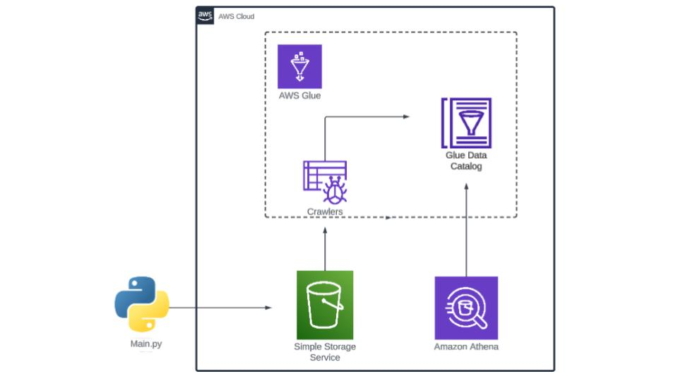
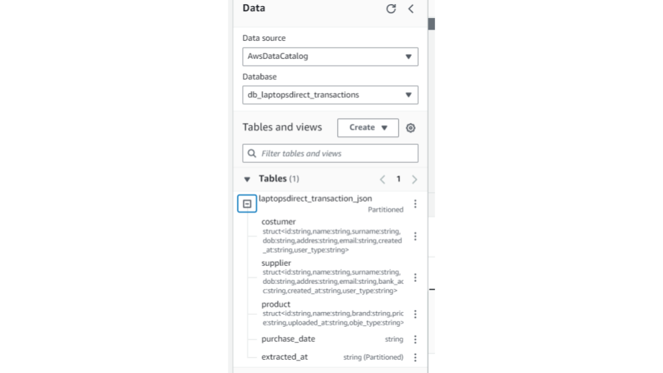
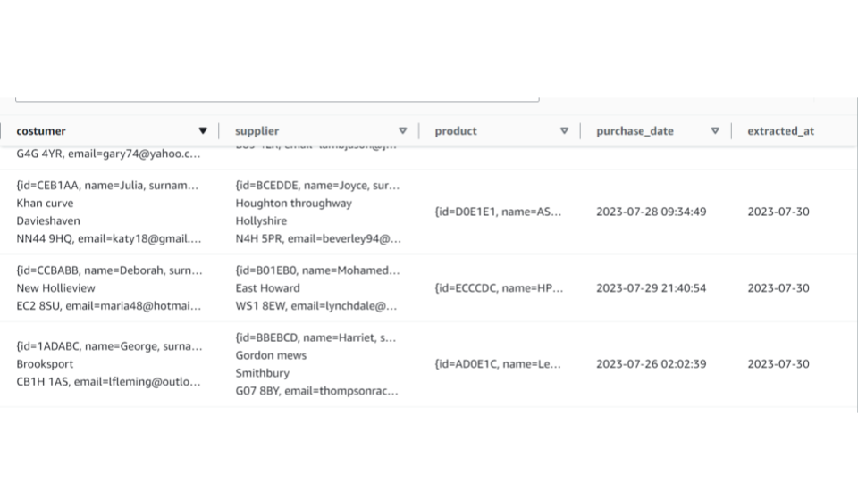

 
 ### Brief Introduction
 This is part 1/3 of a project that showcases the ETL process.
 
Part 1, specifically, demonstrates how to ingest data to a S3 bucket using boto3 to organize it with layers and partitions. Also, it shows how to use crawlers to create table definitions in the AWS Glue Data Catalog to enable quering using Athena. 
  
In order to imitate a realistic development environment I have created a fake e-commerce ecosystem by both generating dummy transactional sales data.

To generate this data, the project uses the <code>Faker</code> library to create user information and scrapes https://www.laptopsdirect.co.uk/ct/laptops-and-netbooks/laptops using the <code>Beautifulsoup</code> library to collect real laptop information such as product name, price, and brand.

### Instructions - how does it run?

All the commands are centralised in <code>python_scripts/main.py</code>. To run the project, you'll need to navigate to  <code>python_scripts/main.py</code> file. Once there, you can choose how many new transactions you would like to create and if you want to ingest the data to a S3 bucket. There are two editable variables: <code>number_of_new_transactions</code> and <code>ingest_file_to_s3</code>

<ul>
<li><code>number_of_new_transactions</code>  - edit the integer variable to specify how many new transactions you'd like to create.</li>
<li><code>ingest_file_to_s3</code>  -  Set the boolean variable as <strong>True</strong> to ingest all the files in transaction_files to  S3.</li>
</ul>

# How does it work? 

The execution of the <code>main.py</code> triggers <code>boto3</code> to ingest the transaction json files to S3. Then, a crawler scans the data stored in the bucket, extracts metadata, and creates table definitions in the AWS Glue Data Catalog. The table metadata lets the Athena query engine know how to find, read and process, making it possible to query the data in the bucket.

The transaction data is composed of information about the consumer, supplier ,product and purchased date. 

Here an example of a transaction in json format:

    {
        "costumer": {
            "id": "DEAC0B",
             "name": "Shirley", 
             "surname": "Young", 
             "dob": "2002-03-05", 
             "addres": "Flat 49\nKaur neck\nNorth Pamelaton\nS8A 0UU", 
             "email": "valerietaylor@hotmail.com", 
             "created_at": "2023/08/02",
              "user_type": "Costumer"
            },
        "supplier": {
            "id": "EBEDEC", 
            "name": "Joyce",
             "surname": "Godfrey",
              "dob": "1986-02-27", 
              "addres": "17 Adam loaf\nPort Annaland\nB4 9JW", 
              "email": "latkins@kent.net", 
              "bank_acc": "GB84NEFR52083622215459", 
              "created_at": "2023/08/02", 
              "user_type": "Supplier"
            }, 
        "product": {
            "id": "EDD0AA", 
            "name": "Medion Erazer Major X20 Intel Core i9 32GB 1TB RTX 4070 240Hz QHD 16 Inch Windows 11 Gaming Laptop", 
            "brand": "Medion", 
            "price": "\u00a31269.97",
             "uploaded_at": "2023-01-05 04:20:37",
              "obje_type": "Product"
            }, 
        "purchase_date": "2023-07-29 05:27:09"
    }
        

# Bucket layers

The goal for the entire project (parts 1,2,3) is to separate the data in 3 layers:
<ul>  
<li><strong>Landing zone</strong> - The first layer, where raw data is stored after ingesting - No transforamtion </li>
<li><strong>Trusted zone</strong> - The layer that stores the processed data from the Landing layer without any aggregation </li>
<li><strong>Analytics zone</strong>- The layer where the data is brought together from the Truested layer in order to focus on business logic. - Join's & Agreagtions.</li>
</ul>  

Part one of this project focuses on the Landing Zone.

# Bucket Partition

In the Landing Zone the data will be partitioned by the date of the ingestion (extracted_at = ). 

the final path for a file in a given date is: 

<code>s3://1828-landing-zone/laptopsdirect-transaction-json/extracted_at =2023-07-30/2023-07-30.json</code>

## Crawler in AWS Glue and Athena 

Amazon Athena is a serverless interactive query service provided by AWS. It allows you to run SQL queries directly on data stored in Amazon S3, without the need for any infrastructure setup or data loading. However, for Athena to understand the structure of the data in your S3 bucket, it needs metadata, such as the column names, data types, and partitioning information.

This is where a crawler comes in. The crawler automatically scans the data in your S3 bucket, identifies the schema (structure) of the data, and then creates or updates a metadata catalog with this information. The metadata catalog acts as a central repository that holds the schema information, making it easy for Athena to access and understand the data during query execution.

When creating a Crawler you need to:

<ol>
<li>Configure it to point to your S3 bucket</li>
<li>Set which Database the scanned metadata belongs to (a Database is a container for organizing and managing related tables. It helps you logically group your data into separate dataset)</li>
<li>Set which table the scanned metadata belongs to (tables in a database hold information about the structure and data types of the data.)</li>
<li>Schedule the crawler</li>
<li>Create a S3 bucket for the Athena's query results</li>
</ol>

Have a look at the result of the crawler in this project 

You can see here that the information is stored in the table called  <code>laptopsdirect_transaction_json</code>. This table holds the data type of each column and how the data are partitioned(<code>extract_at</code>, in this case). Also, notice that this table is stored in the database named <code>db_laptops_transactions</code>.

 
Here is the a snapshot of the result for a query in Athena.

When executing the SQL query: 

    SELECT *
    FROM"db_laptopsdirect_transactions"."laptopsdirect_transaction_json" 
    limit 10;

As you can see in the images above, the table structure is not easily readable - JSON files are stored in columns. In the next part, I will approach this issue by processing the data using PySpark. The goal will be to clean, save in parquet format and store in the Trusted layer.

# Python scritps explained

### Creating & saving transaction fake data

[main.py](python_scripts/main.py) - It Centralises the execution. It initiates the modules EventsGenerator and S3Ingestion.

[EventsGenerator.py](python_scripts/EventsGenerator.py) - This module generates a single, and random transaction data in a nested Python dictionary data. It brings together consumer, supplier, and product data. 

[Filewriter.py](python_scripts/Filewrite.py)  - The Filewriter module receives the Python dictionary data type from the EventsGenerator module and transforms it into JSON format. It then stores the transaction in a JSON file using the current date as the name. If there are multiple executions, the data will be appended to the existing date file.

### Users - Faker Libary
[User.py](python_scripts/Users.py) - The User module uses the Faker library to create random information for a user, which can be either a Customer or a Supplier. For both types of users, Faker generates the following data: 

ID, name, surname, date of birth, address, and user creation date. 
 
In addition, for Suppliers, Faker generates bank account information.

### Product - Beautifulsoup

[Products.py](python_scripts/Products.py)  -  this module collects brand names, product names, and prices from a WebScraper module and stores them in a text file called 'scrape_dump_product_list.txt' using the FileWriter module.  The reason for saving the scrape result in a text file is to prevent the https://www.laptopsdirect.co.uk/ct/laptops-and-netbooks/laptops server bloking the ip in reponse of multiples requests. 

[WebScraper.py](python_scripts/WebScraper.py)  -  the WebScraper module uses the request library to access the website and the Beautifulsoup library to extract all the HTML product's containers. These containers contain the brand name, product name, and price information.

### Ingesiting the data to S3

[S3Ingestion.py](python_scripts/S3Ingestion.py)  - this module transfers the json files to s3, but only if the file is dated before the current date, in order to avoid duplicating data. In other words: the today's transaction data will be ingested tommorow (when the date is complete)

Using boto3, this module: 
<ul>            
<li>Creates a bucket if the bucket doesnt exist</li>
<li>Checks the avaibility of the bucket name.</li>
<li>Ingests all the files in the folder transaction_file and dumps in the S3 Bucket.</li>
<li>Delete all the ingested files from the 'transaction_file' director.</li>
</ul>

## What's next?
Next, I will work on the process of the data in the Landing zone  and store it in the Trusted zone using Amazon EMR.   

